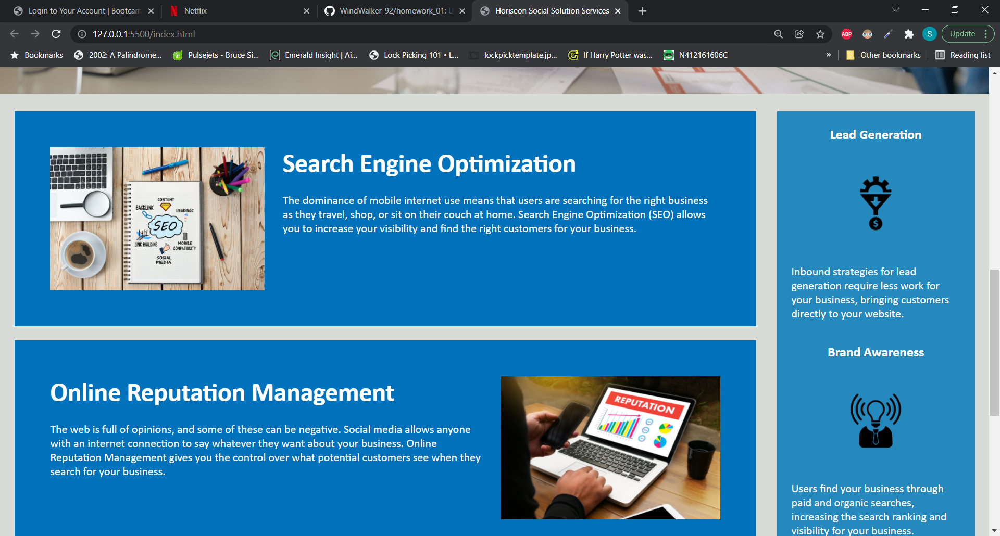
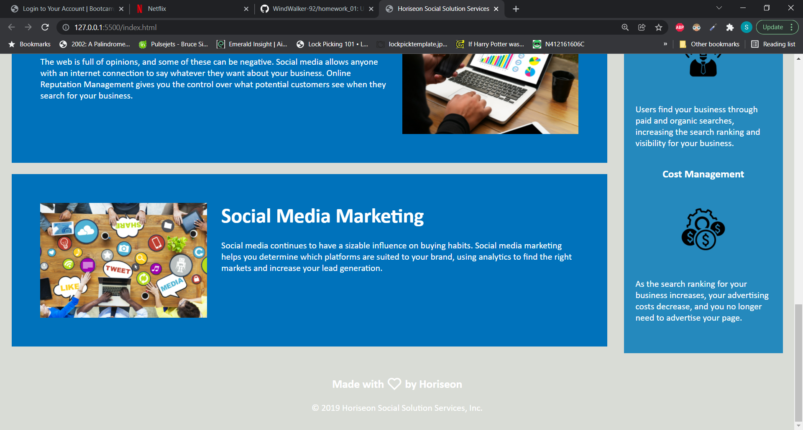

# homework_01

This homework assignment was a refactor of an existing webpage to improve the accessibility of the HTML and CSS.
The requirements were listed as follows:

GIVEN a webpage meets accessibility standards
WHEN I view the source code
THEN I find semantic HTML elements
WHEN I view the structure of the HTML elements
THEN I find that the elements follow a logical structure independent of styling and positioning
WHEN I view the icon and image elements
THEN I find accessible alt attributes
WHEN I view the heading attributes
THEN they fall in sequential order
WHEN I view the title element
THEN I find a concise, descriptive title

Furthermore, according to the standard grading criteria, a couple more tasks became esecially evident. Namely:

1. Consolidate and clean up the CSS to optimize it for both readability and scalability
2. Include a qulality README with a screenshot in the deployment repository.

As such I have updated the HTML to include as many accessible tags as I could find. I also refactored the CSS to a more compact, better orgnized level.
See below for a series of screenshots from my finished product.

